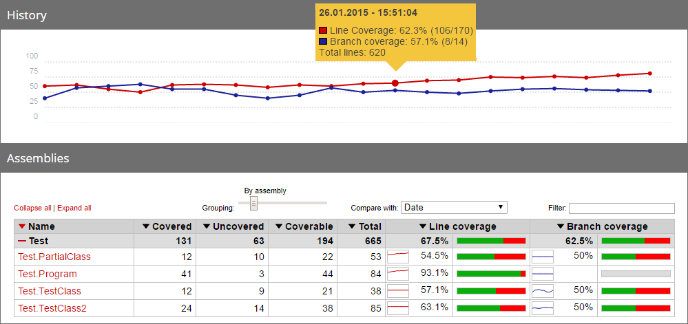
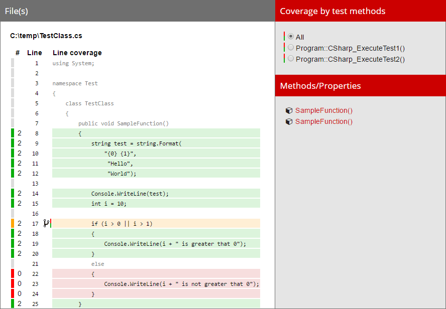

# ReportGenerator
*ReportGenerator* converts coverage reports generated by OpenCover, dotCover, Visual Studio, NCover, Cobertura, JaCoCo, Clover, gcov or lcov into human readable reports in various formats.

Author: Daniel Palme  
Blog: [www.palmmedia.de](https://www.palmmedia.de)  
Twitter: [@danielpalme](https://twitter.com/danielpalme)  

## Usage
To learn how to use *ReportGenerator* have a look at the:
* [Usage Guide](https://danielpalme.github.io/ReportGenerator/usage.html)
* [Command line parameters](https://github.com/danielpalme/ReportGenerator/#usage--command-line-parameters)

### Attention
The [Publish Code Coverage Results](https://github.com/microsoft/azure-pipelines-tasks/tree/master/Tasks/PublishCodeCoverageResultsV1) task from Microsoft regenerates the report with different settings and based on the supplied _Coberatura_ file (see [announcement](https://docs.microsoft.com/en-us/azure/devops/release-notes/2019/sprint-150-update#cobertura-code-coverage-report-updates)). Moreover it does not necessarily use the latest version of _ReportGenerator_.  
To disable the regeneration of the report, you can use the following environment variable in your build:
```yaml
disable.coverage.autogenerate: 'true'
```

## Screenshots
The screenshots show two snippets of the generated reports:


